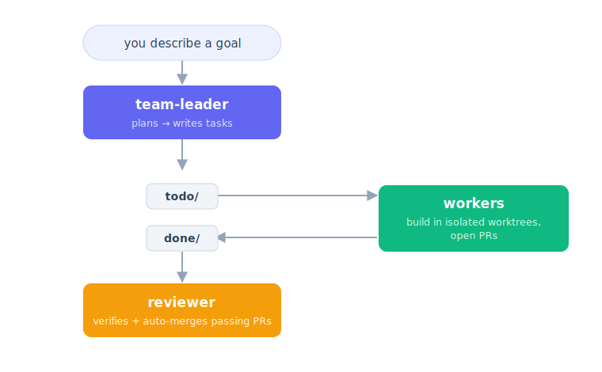
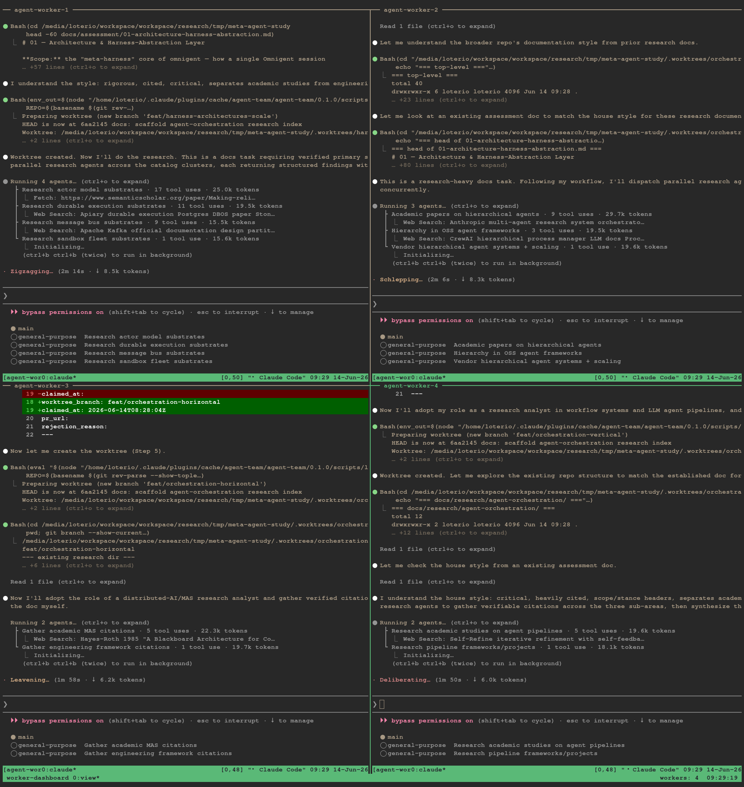

# agent-team

**Turn one repo into a team of Claude Code agents that plan, build, and review
work for you — in parallel.**

You describe a goal. A **team-leader** breaks it into tasks. **Worker** sessions
pick up tasks, each builds in its own isolated git worktree and opens a PR, and a
**reviewer** checks the work and merges what passes. Everything runs in tmux
sessions so the team keeps going while you do other things.

It's event-driven, not polling — the leader wakes the moment a task arrives or a
worker finishes, so nothing sits idle waiting for the next tick.

> 🎥 **New here?** Watch the [walkthrough video](https://www.youtube.com/watch?v=qWWWYjdr_l0) for a guided tour of how to use the project.

<p align="center">
  
</p>

## Quick start

### 1. Check you have the prerequisites

- Linux or macOS (on Windows, use WSL2 — see [below](#windows))
- Node.js >= 20
- `git`, `tmux`, `gh` (run `gh auth login` first), and `claude` (Claude Code)

### 2. Install the plugin

```
/plugin marketplace add natanloterio/agent-team
/plugin install agent-team@agent-team
/agent-team:setup
```

`/agent-team:setup` walks you through a dependency check (it tells you what's
missing and the exact command to run — it never installs anything itself),
writes `.agent-team/config.json`, creates the task queue, and optionally connects
a Trello board.

### 3. Start coordinating

Open a session and run `/agent-team:team-leader`, then describe what you want
built. The leader takes it from there.

## How the task queue works

Tasks are Markdown files with YAML frontmatter that move between folders as they
progress:

```
.tasks/
  todo/      ← available, waiting for a worker
  doing/     ← claimed by a worker
  done/      ← finished, awaiting review
  approved/  ← reviewed and approved
  backlog/   ← blocked
```

The queue is gitignored and shared across every parallel session via symlinks
created by `gwt.sh`.

## The three roles

Each role is a Claude Code session you start with a slash command. See
[**Roles in depth**](docs/roles.md) for the full details.

| Role | Command | What it does |
|---|---|---|
| **Team-leader** | `/agent-team:team-leader` | Breaks goals into tasks, dispatches workers, kicks off reviews. Offers a [Brainstorm Mode](docs/roles.md#brainstorm-mode) for vague goals. |
| **Worker** | `/agent-team:worker` | Claims one task, builds it in an isolated worktree following TDD, opens a PR. |
| **Reviewer** | `/agent-team:reviewer` | Verifies acceptance criteria, runs UI checks, auto-merges passing PRs or rejects with a reason. |

> Watch a single worker live with `tmux attach -t <session-name>`.

## Watch the whole team in one view

To see **every** worker at once instead of attaching to them one by one, open
the live dashboard:

```
bash scripts/watch-workers.sh
```

<p align="center">
  
</p>

It opens a tmux session that tiles every running `agent-worker-*` session into a
single window — one pane per worker, each mirroring that worker's output live. It
is **read-only** (it never resizes or sends keystrokes to the workers) and
**dynamic** (new workers are tiled in as the team grows; finished ones are marked
`(ended)`). Detach with `Ctrl-b d`; the team keeps running.

```
bash scripts/watch-workers.sh --once   # one-shot text snapshot, no tmux session
bash scripts/watch-workers.sh --help   # all options
```

See [**Watching the team**](docs/watch-workers.md) for details.

## Learn more

- 📖 [**Roles in depth**](docs/roles.md) — how dispatch, brainstorming, workers, and review actually work
- 📺 [**Watching the team**](docs/watch-workers.md) — the live tmux dashboard for all workers
- ⚙️ [**Configuration reference**](docs/configuration.md) — every field in `.agent-team/config.json`
- 🔒 [**Security model**](docs/security.md) — **read before running on repos with secrets or untrusted tasks**
- 🩺 [**Troubleshooting**](docs/troubleshooting.md) — start with `/agent-team:doctor`

## Windows

Native Windows isn't supported in v1. Use WSL2 — everything works inside a WSL
distro once the prerequisites above are installed there.

## License

MIT
